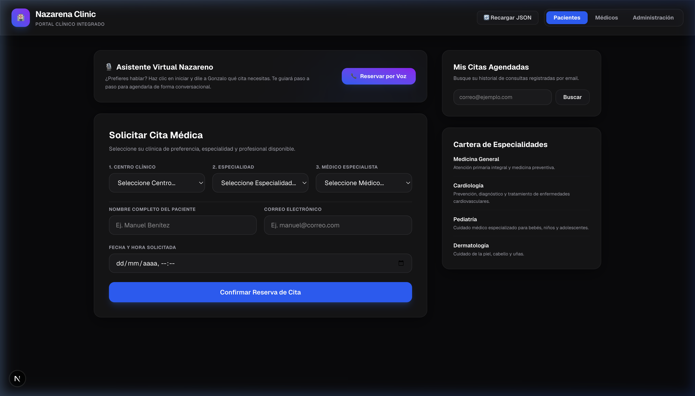
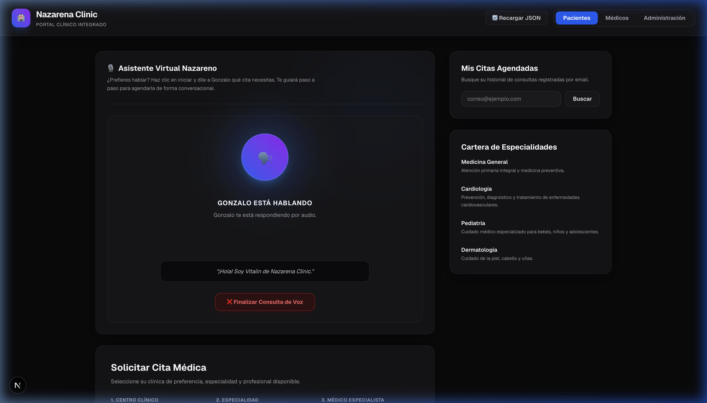
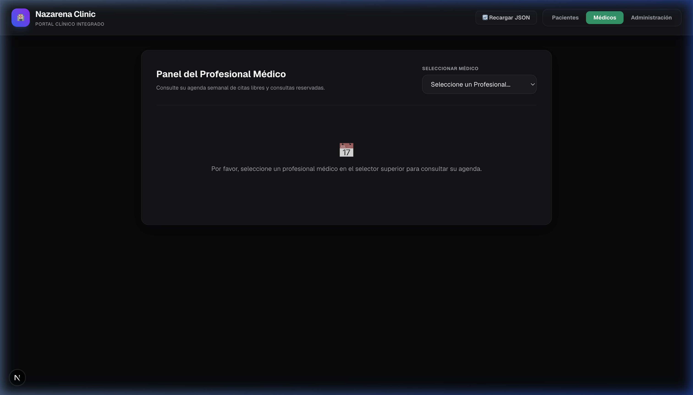
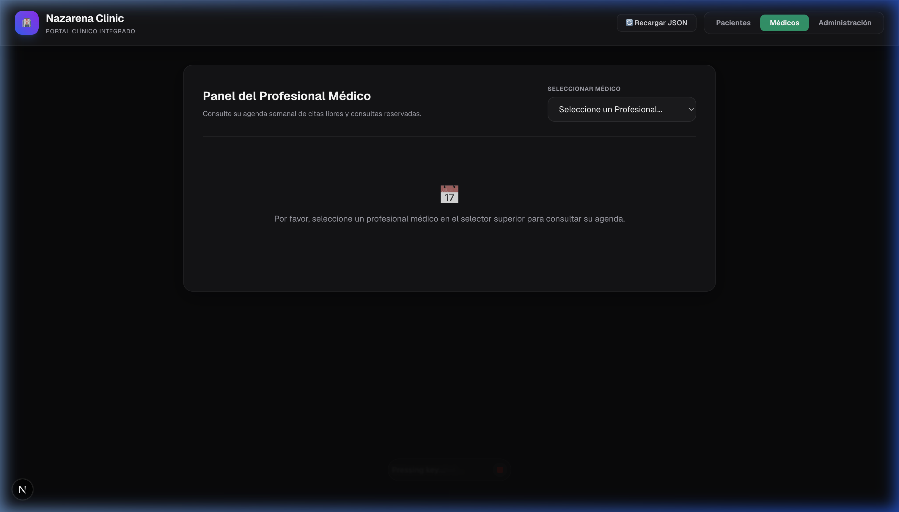
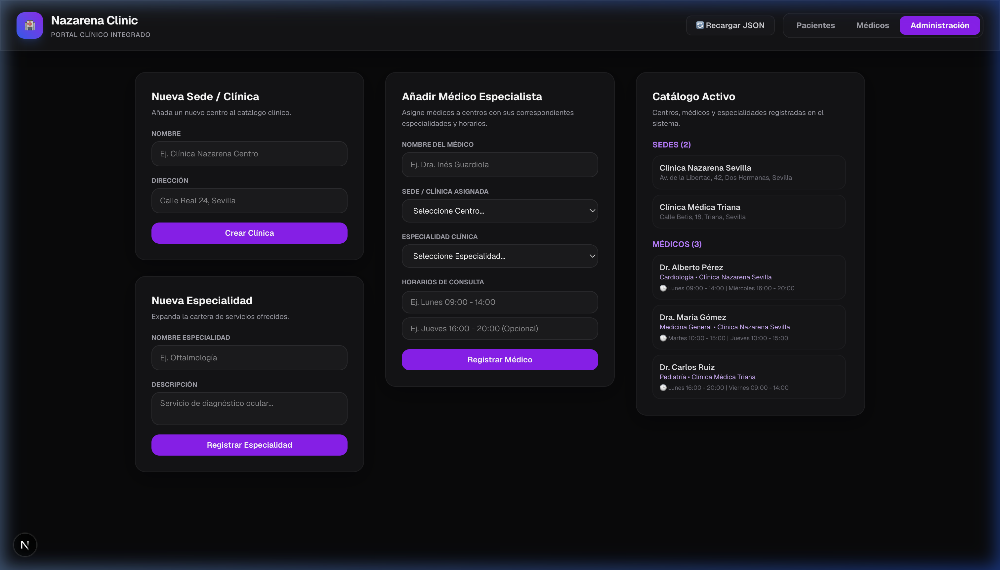

# Vitalin - Asistente Médico Inteligente (Prueba de Concepto)

¡Bienvenido al repositorio de **Vitalin**, una prueba de concepto (PoC) rápida diseñada para demostrar cómo la inteligencia artificial generativa multimodal en tiempo real puede transformar la experiencia de gestión de citas médicas en clínicas de salud!

Este proyecto ilustra la integración de agentes de voz avanzados que permiten a los pacientes agendar, consultar y cancelar citas médicas a través de una conversación hablada y natural en el navegador web.

---

## 💡 Motivación del Proyecto

El objetivo principal de esta **prueba de concepto rápida** es explorar y validar la viabilidad técnica de una interfaz de usuario conversacional basada en voz y video en tiempo real. 

Tradicionalmente, la reserva de citas en línea requiere rellenar largos formularios, navegar por múltiples menús o esperar en líneas telefónicas. **Vitalin** plantea una alternativa simplificada y humana:
* **Naturalidad:** El paciente simplemente habla con el asistente ("Vitalin") tal como lo haría con un recepcionista humano.
* **Agilidad:** El asistente valida en tiempo real la disponibilidad de los médicos, clínicas y especialidades a través de funciones integradas (Function Calling).
* **Multimodalidad:** Se proporciona soporte para canales de audio y visión bidireccional por si el usuario desea mostrar algún documento u objeto en cámara.

---

## 🛠️ Stack Tecnológico

El proyecto está construido sobre las siguientes tecnologías y frameworks:

1. **Frontend (Next.js 15+ App Router):**
   * Estructura moderna de páginas y layouts (`app/page.tsx`).
   * API Routes para interactuar de forma segura con recursos y credenciales (`app/api/*`).
   * Integración de componentes reactivos con `@livekit/components-react` y styling optimizado.

2. **Servicios de Comunicación (LiveKit Cloud & WebRTC):**
   * **LiveKit** proporciona la infraestructura de transporte en tiempo real basada en WebRTC con ultra-baja latencia.
   * Gestión de tokens de acceso seguros (`livekit-server-sdk`) y salas virtuales dinámicas.

3. **Inteligencia Artificial (Google Gemini Multimodal Realtime API):**
   * Se utiliza el modelo **`gemini-3.1-flash-live-preview`** a través de la API en tiempo real por WebSockets de LiveKit.
   * Conexión directa y fluida que soporta entrada/salida de audio sin necesidad de ciclos tradicionales de transcripción de texto intermedios (STT -> LLM -> TTS), reduciendo drásticamente la latencia.

4. **Agente/Worker de Voz (`@livekit/agents`):**
   * Un proceso de fondo en Node.js/TypeScript que escucha las salas creadas de LiveKit, se conecta automáticamente y arranca la sesión del agente conversacional.

---

## 🔄 ¿Cómo Funciona la Reserva de Citas?

La comunicación y lógica del flujo de citas se orquesta a través de las siguientes fases:

```
[ Paciente en Navegador ]
         │ (WebRTC)
         ▼
  [ Sala LiveKit ] ◄──► [ LiveKit Agent / Worker (Node.js) ]
                              │ (WebSockets)
                              ▼
                   [ Gemini Realtime API ] ◄──► [ Herramientas de Cita / APIs locales ]
```

### 1. Conexión de la Sesión
* Cuando el usuario ingresa a la aplicación web, Next.js solicita un token de acceso temporal mediante el endpoint `/api/livekit`.
* Con este token, el cliente web abre una conexión de sala WebRTC en tiempo real.
* El **LiveKit Agent Worker** en ejecución (`agent/run-worker.ts`) detecta al nuevo participante y conecta un agente de voz personalizado que saluda proactivamente.

### 2. Flujo de Diálogo de la Cita
El agente conversacional sigue unas instrucciones sistemáticas (`agent/core/prompts.ts`):
1. **Identificación y Consulta:** Saluda al paciente e indaga si desea reservar, consultar o cancelar una cita.
2. **Uso de Herramientas (Function Calling):** Para responder con datos reales, el modelo Gemini invoca dinámicamente herramientas que consultan los endpoints internos de Next.js:
   * `getClinics`: Obtiene las sedes de centros médicos disponibles.
   * `getSpecialties`: Obtiene las especialidades médicas de la cartera.
   * `getDoctors`: Recupera los médicos y sus horarios para validar disponibilidad en tiempo real.
3. **Validación Obligatoria:** Antes de proceder con la reserva, el agente recopila de manera conversacional los 6 datos clave:
   * Nombre completo
   * Correo electrónico
   * Centro clínico de preferencia
   * Especialidad médica
   * Médico especialista
   * Fecha y hora deseadas (dentro del horario del médico)
4. **Confirmación Verbal Previa:** El agente lee pausadamente la propuesta de cita recopilada al paciente para que confirme verbalmente.
5. **Ejecución y Registro:** Una vez recibido el "sí" del paciente, llama a la herramienta `bookAppointment` para guardar la cita en la base de datos a través de la API.

### 3. Cancelación e Información Adicional
* Si el paciente proporciona su correo, el agente puede buscar citas existentes con `getPatientAppointments` e incluso cancelarlas con `cancelAppointment` si se le facilita la referencia de la cita.
* En el caso de que la conversación finalice, el agente ejecuta la herramienta `endSession` para colgar automáticamente la llamada del lado del cliente.
* El agente cuenta además con la capacidad opcional de realizar búsquedas web en vivo a través de la herramienta `searchWeb` para responder a dudas externas o de actualidad local.

---

## 🔑 Variables de Entorno Requeridas

Crea un archivo `.env.local` en la raíz del proyecto con el siguiente formato:

```env
# URL de conexión de la nube o servidor local de LiveKit
LIVEKIT_URL=wss://<tu-subdominio>.livekit.cloud
NEXT_PUBLIC_LIVEKIT_URL=wss://<tu-subdominio>.livekit.cloud

# Credenciales de API de LiveKit
LIVEKIT_API_KEY=tu_api_key_de_livekit
LIVEKIT_API_SECRET=tu_api_secret_de_livekit

# API Key de Google Gemini con acceso a la API Live
GEMINI_API_KEY=tu_gemini_api_key
```

---

## 🚀 Cómo Ejecutar el Proyecto

Para probar el flujo completo de forma local, debes iniciar dos procesos simultáneamente:

### Paso 1: Levantar la aplicación Next.js
Instala las dependencias y corre el servidor de desarrollo web:

```bash
npm install
npm run dev
```
La aplicación web estará disponible en `http://localhost:3000`.

### Paso 2: Levantar el LiveKit Agent Worker
Abre otra terminal y ejecuta el proceso que hospeda y conecta el Agente de Inteligencia Artificial:

```bash
npm run agent:dev
# O ejecutando el comando del CLI de LiveKit directamente en TypeScript:
# npx tsx agent/run-worker.ts dev
```

Una vez que ambos servicios estén en funcionamiento, abre el navegador, conéctate a la sesión en la interfaz web y comienza a conversar con **Vitalin** para agendar tu cita médica.

---

## 📸 Capturas de Pantalla

A continuación se muestran algunas capturas de la interfaz y las distintas vistas de la aplicación:

### 1. Portal del Paciente (Inicio)


### 2. Conversación Activa con el Agente de Voz (Vitalin)


### 3. Buscador y Listado de Médicos


### 4. Consulta de Horarios y Disponibilidad de Especialistas


### 5. Panel de Administración y Configuración


